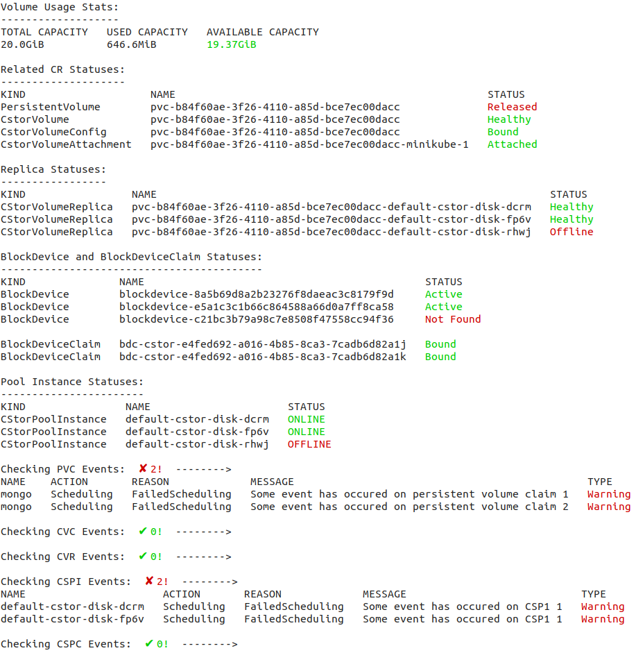

# CSTOR Storage Engine Components 

## Table of Contents
* [cStor](#cstor)
    * [Get cStor volumes](#get-cstor-volumes)
    * [Get cStor pools](#get-cstor-pools)
    * [Describe cStor volumes](#describe-cstor-volumes)
    * [Describe cStor pool](#describe-cstor-pool)
    * [Describe cStor PVCs](#describe-cstor-pvcs)
    * [Debugging cStor Volumes](#debugging-cstor-volumes)
* [BlockDevice](#blockdevice)
    * [Get BlockDevices by Nodes](#get-blockdevices-by-nodes)

* #### `cStor`
    * #### Get `cStor` volumes
      ```bash
      $ kubectl openebs get volumes --cas-type=cstor
      NAMESPACE   NAME                                       STATUS    VERSION    CAPACITY   STORAGE CLASS         ATTACHED   ACCESS MODE      ATTACHED NODE
      cstor       pvc-193844d7-3bef-45a3-8b7d-ed3991391b45   Healthy   2.9.0      5.0 GiB    cstor-csi-sc          Bound      ReadWriteOnce    N/A
      cstor       pvc-b84f60ae-3f26-4110-a85d-bce7ec00dacc   Healthy   2.0.0      20 GiB     common-storageclass   Bound      ReadWriteOnce    node1-virtual-machine
      ```
      Note: For volumes not attached to any application, the `ATTACH NODE` would be shown as `N/A`.
    * #### Get `cStor` pools
      ```bash
      $ kubectl openebs get storage --cas-type=cstor
      NAME                      HOSTNAME                FREE     CAPACITY   READ ONLY   PROVISIONED REPLICAS   HEALTHY REPLICAS   STATUS    AGE
      cstor-storage-k5c2        node1-virtual-machine   45 GiB   45 GiB     false       1                      0                  ONLINE    10d2h
      default-cstor-disk-dcrm   node1-virtual-machine   73 GiB   90 GiB     false       7                      7                  ONLINE    27d2h
      default-cstor-disk-fp6v   node2-virtual-machine   73 GiB   90 GiB     false       7                      7                  ONLINE    27d2h
      default-cstor-disk-rhwj   node1-virtual-machine   73 GiB   90 GiB     false       7                      4                  OFFLINE   27d2h
      ```
    * #### Describe `cStor` volumes
      ```bash
      $ kubectl openebs describe volume pvc-193844d7-3bef-45a3-8b7d-ed3991391b45
  
      pvc-193844d7-3bef-45a3-8b7d-ed3991391b45 Details :
      -----------------
      NAME            : pvc-193844d7-3bef-45a3-8b7d-ed3991391b45
      ACCESS MODE     : ReadWriteOnce
      CSI DRIVER      : cstor.csi.openebs.io
      STORAGE CLASS   : cstor-csi
      VOLUME PHASE    : Released
      VERSION         : 2.9.0
      CSPC            : cstor-storage
      SIZE            : 5.0 GiB
      STATUS          : Init
      REPLICA COUNT	: 1
      
      Portal Details :
      ------------------
      IQN              :  iqn.2016-09.com.openebs.cstor:pvc-193844d7-3bef-45a3-8b7d-ed3991391b45
      VOLUME NAME      :  pvc-193844d7-3bef-45a3-8b7d-ed3991391b45
      TARGET NODE NAME :  node1-virtual-machine
      PORTAL           :  10.106.27.10:3260
      TARGET IP        :  10.106.27.10
      
      Replica Details :
      -----------------
      NAME                                                          TOTAL    USED      STATUS    AGE
      pvc-193844d7-3bef-45a3-8b7d-ed3991391b45-cstor-storage-k5c2   72 KiB   4.8 MiB   Healthy   10d3h
      
      Cstor Completed Backup Details :
      -------------------------------
      NAME                                               BACKUP NAME   VOLUME NAME                                LAST SNAP NAME
      backup4-pvc-b026cde1-28d9-40ff-ba95-2f3a6c1d5668   backup4       pvc-193844d7-3bef-45a3-8b7d-ed3991391b45   backup4
      
      Cstor Restores Details :
      -----------------------
      NAME                                           RESTORE NAME   VOLUME NAME                                RESTORE SOURCE       STORAGE CLASS   STATUS
      backup4-3cc0839b-8428-4361-8b12-eb8509208871   backup4        pvc-193844d7-3bef-45a3-8b7d-ed3991391b45   192.168.1.165:9000   cstor-csi       0
      ```
    * #### Describe `cStor` pool
      ```bash
      $ kubectl openebs describe storage default-cstor-disk-fp6v --openebs-namespace=openebs
      
      default-cstor-disk-fp6v Details :
      ----------------
      NAME             : default-cstor-disk-fp6v
      HOSTNAME         : node1-virtual-machine
      SIZE             : 90 GiB
      FREE CAPACITY    : 73 GiB
      READ ONLY STATUS : false
      STATUS	         : ONLINE
      RAID TYPE        : stripe
      
      Blockdevice details :
      ---------------------
      NAME                                           CAPACITY   STATE
      blockdevice-8a5b69d8a2b23276f8daeac3c8179f9d   100 GiB    Active
      
      Replica Details :
      -----------------
      NAME                                                               PVC NAME   SIZE      STATE
      pvc-b84f60ae-3f26-4110-a85d-bce7ec00dacc-default-cstor-disk-fp6v   mongo      992 MiB   Healthy
      ```
    * #### Update a pool after disks have moved
      ```bash
      $ kubectl openebs update storage default-cstor-disk --from-node=node1-virtual-machine --to-node=node1-failover
      # the relevant node selectors get updated
      ```
    * #### Describe `cstor` pvcs
      Describe any PVC using this command, it will determine the cas engine and show details accordingly.
      ```bash
      $ kubectl openebs describe pvc mongo
    
      mongo Details :
      ------------------
      NAME             : mongo
      NAMESPACE        : default
      CAS TYPE         : cstor
      BOUND VOLUME     : pvc-b84f60ae-3f26-4110-a85d-bce7ec00dacc
      ATTACHED TO NODE : node1-virtual-machine
      POOL             : default-cstor-disk
      STORAGE CLASS    : common-storageclass
      SIZE             : 20 GiB
      USED             : 1.1 GiB
      PV STATUS	 : Healthy
      
      Target Details :
      ----------------
      NAMESPACE   NAME                                                              READY   STATUS    AGE      IP           NODE
      openebs     pvc-b84f60ae-3f26-4110-a85d-bce7ec00dacc-target-7487cbc8bc5ttzl   3/3     Running   26d22h   172.17.0.7   node1-virtual-machine
      
      Replica Details :
      -----------------
      NAME                                                               TOTAL     USED      STATUS    AGE
      pvc-b84f60ae-3f26-4110-a85d-bce7ec00dacc-default-cstor-disk-dcrm   992 MiB   1.1 GiB   Healthy   26d23h
      pvc-b84f60ae-3f26-4110-a85d-bce7ec00dacc-default-cstor-disk-fp6v   992 MiB   1.1 GiB   Healthy   26d23h
      pvc-b84f60ae-3f26-4110-a85d-bce7ec00dacc-default-cstor-disk-rhwj   682 MiB   832 MiB   Offline   26d23h
      
      Additional Details from CVC :
      -----------------------------
      NAME          : pvc-b84f60ae-3f26-4110-a85d-bce7ec00dacc
      REPLICA COUNT : 3
      POOL INFO     : [default-cstor-disk-dcrm default-cstor-disk-fp6v default-cstor-disk-rhwj]
      VERSION       : 2.1.0
      UPGRADING     : true
      ```
    * #### Debugging `cstor` volumes
      _NOTE: Currently supported only for cstor_
      ```bash
      $ kubectl openebs describe pvc mongo --openebs-namespace=openebs --debug
      ```
      

* #### `BlockDevice`
    * #### Get `BlockDevices` by Nodes
      ```bash
      $ kubectl openebs get bd
      NAME                                             PATH            SIZE      CLAIMSTATE   STATUS     FSTYPE       MOUNTPOINT
      minikube-2                                                                                                      
      ├─blockdevice-94312c16fb24476c3a155c34f0c211c3   /dev/sdb1       50 GiB    Unclaimed    Inactive   ext4         /var/lib/kubelet/mntpt
      └─blockdevice-94312c16fb24476c3a155c34f0c2143c   /dev/sdb1       50 GiB    Claimed      Active
      
      minikube-1                                                                                                      
      ├─blockdevice-94312c16fb24476c3a155c34f0c6153a   /dev/sdb1       50 GiB    Claimed      Inactive   zfs_member   /var/openebs/zfsvol
      ├─blockdevice-8a5b69d8a2b23276f8daeac3c8179f9d   /dev/nvme2n1    100 GiB   Claimed      Active                  
      └─blockdevice-e5a1c3c1b66c864588a66d0a7ff8ca58   /dev/nvme10n1   100 GiB   Claimed      Active
      
      minikube-3                                                                                                      
      └─blockdevice-94312c16fb24476c3a155c34f0c6199k   /dev/sdb1       50 GiB    Claimed      Active               
      ```
    
